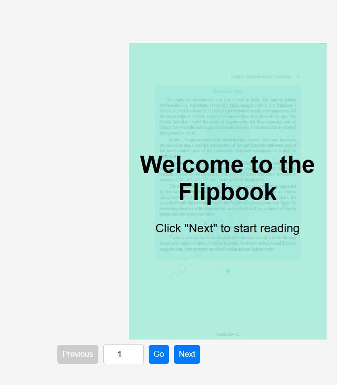

# PDF Flipbook by Pawan Kumar Sahu

A simple, responsive PDF flipbook built with **HTML, CSS, JavaScript**, and **Turn.js**. Supports mouse hover page turning, navigation buttons, and a cover page.

## 🚀 Features

✅ **Flipbook-style PDF viewer**
✅ **Mouse hover to turn pages**
✅ **Next/Previous buttons**
✅ **Go to specific page input**
✅ **Cover page on startup**
✅ **Responsive design (Mobile & PC)**
✅ **Loader animation before rendering**

## 📌 Installation

1. Clone the repository:
   ```sh
   git clone https://github.com/pwnkmrsh/flipBook.git
   ```
2. Navigate into the project folder:
   ```sh
   cd flipBook
   ```
3. Open `index.html` in your browser.

## 🛠️ Usage

- Place your PDF file in the project folder.
- Update the `pdfPath` variable in `index.html`:
  ```js
  const pdfPath = "your-pdf-file.pdf";  // Change this to your actual PDF file
  ```
- Open the project in a browser and **hover near the edges** to flip pages.

## 📷 Screenshots



## 🏗 Built With

- [HTML5](https://developer.mozilla.org/en-US/docs/Web/Guide/HTML/HTML5)
- [CSS3](https://developer.mozilla.org/en-US/docs/Web/CSS)
- [JavaScript](https://developer.mozilla.org/en-US/docs/Web/JavaScript)
- [Turn.js](https://www.turnjs.com/)
- [PDF.js](https://mozilla.github.io/pdf.js/)

## 💡 Contributing

Pull requests are welcome! If you find a bug or have a feature request, please open an issue.

## 📜 License

This project is licensed under the **MIT License** - see the `LICENSE` file for details.

## 📧 Contact

For questions or feedback, contact me at **pwnkmrsh@gmail.com**.

